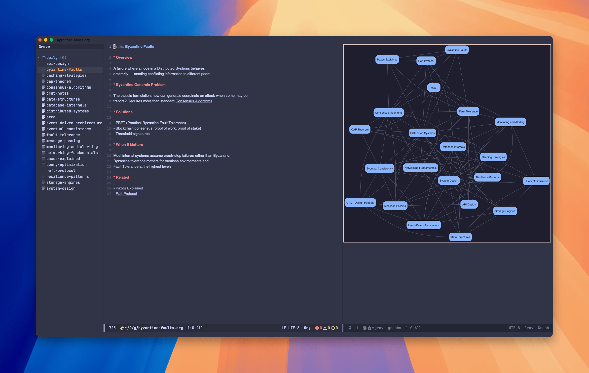

#+title: grove.el
#+author: Jonathan Chu

An Obsidian-like note-taking mode for Emacs. One keybinding opens a full workspace with a file tree sidebar and your org notes.

[[file:https://img.shields.io/badge/license-GPL--3.0-blue.svg]]

* Features

- *File tree sidebar* with expand/collapse, indent guides, current file tracking, item counts, optional nerd font icons, and note preview on navigation
- *Quick capture* — just type, first line becomes the title, saved to your inbox
- *Wikilinks* — =[[note title]]= syntax with font-lock, click to follow, create on missing
- *Backlinks* — ripgrep-powered, computed on demand, displayed in a side panel
- *Daily notes* — one keybinding for today, yesterday, or tomorrow
- *Search* — full-text ripgrep search with optional Consult integration
- *Tag search* — find notes by =#hashtag= or org =:tag:= syntax
- *Inbox review* — triage untagged notes
- *Graph view* — visualize note connections via Graphviz

No database. No external Emacs dependencies. Just org files, a directory, and ripgrep.

* Requirements

- Emacs 29.1+
- [[https://github.com/BurntSushi/ripgrep][ripgrep]] (=rg=) on your PATH

Optional:
- [[https://github.com/minad/consult][Consult]] for live search with preview
- [[https://graphviz.org][Graphviz]] (=dot=) for graph view
- [[https://www.nerdfonts.com][Nerd Fonts]] for file/folder icons in the tree sidebar

* Installation

** Manual

Clone the repository and add it to your load path:

#+begin_src emacs-lisp
(use-package grove
  :load-path "~/path/to/grove"
  :bind-keymap ("C-c v" . grove-command-map)
  :custom
  (grove-directory "~/notes/"))
#+end_src

** MELPA

Coming soon.

* Usage

Set your vault directory and press =C-c v v= to open the workspace.

| Key       | Command              | Description                 |
|-----------+----------------------+-----------------------------|
| =C-c v v= | =grove-open=         | Open the grove workspace    |
| =C-c v q= | =grove-close=        | Close and restore layout    |
| =C-c v n= | =grove-capture=      | Quick capture a new note    |
| =C-c v f= | =grove-find=         | Find note by title          |
| =C-c v s= | =grove-search=       | Full-text ripgrep search    |
| =C-c v d= | =grove-daily=        | Open today's daily note     |
| =C-c v b= | =grove-backlinks=    | Show backlinks for note     |
| =C-c v t= | =grove-search-tag=   | Search by tag               |
| =C-c v i= | =grove-inbox-review= | Triage untagged notes       |
| =C-c v l= | =grove-link-insert=  | Insert a wikilink           |
| =C-c v g= | =grove-graph=        | Show vault graph            |

** Tree sidebar

| Key   | Action                     |
|-------+----------------------------|
| =RET= | Open file / toggle dir     |
| =TAB= | Toggle directory expand    |
| =n= / =C-n= | Next entry (with preview)  |
| =p= / =C-p= | Previous entry (with preview) |
| =g=   | Refresh tree               |
| =q=   | Close sidebar              |

** Capture

=C-c v n= opens a blank org buffer. Type your note freely, then:

- =C-c C-c= to save (first line becomes the title)
- =C-c C-k= to discard

Notes are saved to the inbox subdirectory of your vault.

** Graph

=C-c v g= renders a graph of all notes and their =[[wikilinks]]= using Graphviz. Requires =dot= on your PATH.

The graph display adapts to your frame width — on wide frames (160+ columns) it opens as a right side panel, otherwise it uses a full buffer. You can override this with =grove-graph-display=: ='side=, ='buffer=, or ='auto= (default).

Use =+= / =-= to zoom in/out and =0= to fit to window.

* Configuration

#+begin_src emacs-lisp
;; Required: set your vault directory
(setq grove-directory "~/notes/")

;; Optional: customize subdirectories (defaults shown)
(setq grove-inbox-directory "inbox")
(setq grove-daily-directory "daily")

;; Optional: daily note filename format (default shown)
(setq grove-daily-format "%Y-%m-%d")

;; Optional: tree sidebar width (default shown)
(setq grove-tree-width 30)

;; Optional: show nerd font icons in the tree sidebar
(setq grove-tree-icons t)

;; Optional: graph view settings (defaults shown)
(setq grove-graph-layout "neato")    ; or "dot", "fdp", "sfdp"
(setq grove-graph-display 'auto)     ; or 'side, 'buffer
(setq grove-graph-min-width 160)     ; frame width threshold for auto
#+end_src

* License

GPL-3.0. See [[file:LICENSE][LICENSE]].
